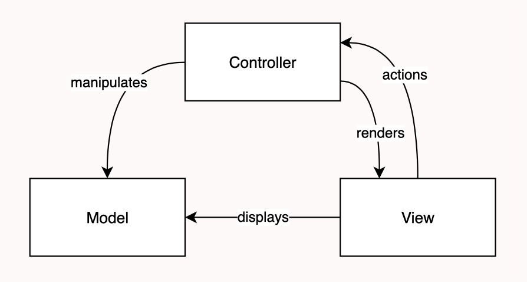

# LDTS <05 01> - THE BEST SNAKE

Para o nosso projeto escolhemos como base o jogo "Snake". O projeto terá vários modos de jogo, nomeadamente, o modo original , um modo multijogador e um modo desafio. Em todos as cobras têm que apanhar frutas para crescer e cumprir o objetivo de cada minijogo.
Este projeto foi desenvolvido por Duarte Lopes up202006408, Leandro Silva up202008061, Tiago Barbosa up202004926 para LDTS 2021/22.

## FUNCIONALIDADES IMPLEMENTADAS

## FUNCIONALIDADES A IMPLEMENTAR

- **Movimentar sozinha** - A cada unidade de tempo a cobra anda na direção em que está a apontar garatindo que está em constante movimento.
- **Movimentar** - Cada cobra irá se mover consoante a tecla pressionada [SETAS OU AWSD].
- **Comer frutas** - Quando a cobra comer uma fruta espalhada pelo ecrã o seu tamanho irá alterar consoante as propriedades dessa fruta.
- **Sair das bordas** - No modo original e multijogador quando a cobra sai pela borda ela regressa do lado oposto.

- **Propriedades das frutas** - Cada fruta terá uma propriedade que modificará o comportamento da cobra que terão vantagens e desvantagens dependendo do modo de jogo. Cada fruta poderá aumentar e diminuir o tamanho em diferentes fatores [-1,+1,*2,/2,...] e também poderá mudar a velocidade da cobra.
- **Fruta mistério** - Esta fruta ao contrário das restantes irá ter propriedades aleatórias cada vez que é consumida.
- **Menu** - Menu com opções para jogar cada modo de jogo, ver as regras de cada jogo e ver as pontuações registadas para cada modo de jogo.

- **Modo original** - O objetivo deste modo é crescer a cobra o máximo possível consumindo frutas e não embatendo nela própria.                              

- **Modo multijogador** - Neste modo existe um "combate" entre duas cobras controladas por dois jogadores distintos onde o objetivo é tentar encurralar a outra cobra levando-a a embater no corpo da adversária. Consoante a estratégia de cada jogador todas as frutas terão vantagens e desvantagens. Tal como no modo original se uma cobra colidir com ela própria também perderá o jogo.

- **Modo desafio** - Neste modo mais desafiante existem paredes a circundar a arena e obstáculos dentro da arena dificultando assim as travessias da cobra. O objetivo deste modo de jogo é a cobra chegar a um tamanho predefinido para poder sair pela porta sagrada. Se a cobra colidir com ela própria , com as paredes ou obstáculos ou tentar entrar na porta sagrada sem o tamanho necessário então o jogo terminará em derrota. Neste modo existirão 3 níveis de dificuldades diferentes com arenas distintas e tamanhos finais variados.                                  

- **Regras** - Se no menu for selecionada a opção das regras irá ser mostrado todas as regras gerais e específicas de cada modo de jogo.
- **Pontuações** - Na opção pontuações irá ser mostrado para cada modo de jogo as melhores pontuações de jogos anteriores mostrando no modo original o tamanha máximo alcançado, no modo multijogador o vencedor e a duração da partida e no modo desafio o tempo necessário para concluir cada nível.

- **Salvar jogo** - Permite guardar quais os níveis já concluídos pelo utilizador e todas as pontuações.
- **Carregar jogo** - Permite carregar a partir de um ficheiro o nível atual no modo desafio e todas as pontuações. Se for iniciado um jogo sem carregar um anterior , o modo desafio irá começar pelo nível fácil e as pontuações estarão vazias.

## DESIGN

### Estrutura do programa

#### Contexto do problema

Primeiro decidimos como estruturar o nosso programa com vista a ser usada uma GUI onde o utilizador iria jogar o nosso jogo.

#### Pattern

Decidimos assim aplicar o **_Architectural Pattern_** mais especificamente o Model-View-Controller visto ser bastante comum para lidar com GUI permitindo interligar os "models", os "viewers" e os "controllers".

#### Implementação

Este pattern permite-nos assim ter classes com o objetivo de guardar informação sobre os vários elementos do jogo como as cobras e as frutas (model), permite ter outras classes que se preocupam em controlar as ações do jogo e os inputs do utilizador (controllers) e permite ter outras que tratam de mostrar no ecrã a execução do programa (viewers) e relacionam-se da seguinte forma:

#### Consequências

O uso deste pattern traz enormes benefícios como:
- Permite um desenvolvimento mais rápido do trabalho visto cada programador estar focado num diferente componente
- Permite nos criar diferentes forma de mostrar os dados do nosso jogo usando viewers diferentes
- Facilita a testagem usando TTD

### Diferentes formas de desenhar os elementos

#### Contexto do problema

O nosso jogo está sempre a atualizar o seu estado e para isso precisamos sempre de mostrar no ecrã os vários elementos em jogo.No entanto cada elemento como as cobras, as frutas, as paredes, etc têm formas diferentes e propriedades diferentes.

#### Pattern

O pattern que nós escolhemos foi o **_Command Pattern_** já que vai permitir mostrar no ecrã todos os elementos usando a mesma função.

#### Implementação

Este pattern evita o uso de várias flags para determinar o tipo de elemento que pretendemos desenhar porque ele remete essa tarefa para o próprio objeto permitindo assim apenas mandar o objeto desenhar-se a si próprio.
Assim podermos apenas percorrer todo os elementos em jogo e fazê-los desenharem-se a eles mesmos.

#### Consequências

O uso deste pattern traz vantagens como:
- Permite que a classe que chama a função não tenha que saber como fazer algo remetendo essa tarefa para cada objeto
- Permite fazer undo/redo
- Facilita a implementação de novos objetos não sendo necessário alterar o objeto que chama a função dos outros.

### Armazenar os elementos do jogo agrupados

#### Contexto do problema

Na nossa arena de jogo temos vários elementos similares como várias paredes ou várias frutas e pretendemos guardar informação sobre estes elementos em jogo como se eles fossem um conjunto.

#### Pattern

Escolhemos usar o **_Composite Pattern_** visto tratar de um conjunto com partes e todos.

#### Implementação

Ao guardarmos todas as paredes numa lista e depois ao armazenar essa lista tratando-a como se também fosse um elemento da nossa arena permite-nos facilitar a nossa visão geral sobre os elementos em jogo. Visto todas as paredes terem funcionalidades iguais como por exemplo a de se desenhar a si próprias então ao criarmos um grupo de paredes este também vai saber se desenhar a si próprio fazendo um ciclo que desenha cada uma das suas partes.
Com este pattern também podemos guardar "partes" como por exemplo se estivermos no modo desafio e apenas precisarmos de uma porta e não de um conjunto de portas então apenas iremos lidar com uma porta. Assim, na lista de elementos em jogo, irá estar elementos sozinhos e grupo de elementos consoante o necessário. 
#### Consequências

O uso deste pattern traz vantagens como:
- Simplifica na generalidade como os objetos são tratados
- Permite a fácil introdução de um novo componente
- Agrupa vários elementos com as mesmas propriedades e com comportamentos iguais

### Lidar com os inputs do utilizador

#### Contexto do problema

A nossa cobra está sempre a movimentar-se e apenas muda de direção quando o utilizador pressiona uma das teclas pelo que não é necessário estar sempre à espera de um input do utilizador.

#### Pattern

Aplicámos aqui o **_Observer pattern_** para ter um objeto que indica ao programa quando uma tecla foi pressionada e é necessário o seu processamento.

#### Implementação

Com este Observer/Listener não é necessário a cada período que a nossa cobra se movimenta verificar se alguma tecla foi premida para mudar a direção da cobra, pois o observer irá avisar o programa fornecendo-lhe as keys a serem processadas.
Isto facilita no modo multijogador pois assim o observer pode analisar o "buffer" do teclado conseguindo devolver ao programa as teclas pressionadas por cada jogador permitindo assim ao programa processar o movimento das duas cobras simultaneamente o que sem ele não seria possível pois apenas uma tecla seria processada por cada ciclo logo apenas uma cobra se iria movimentar a cada período.

#### Consequências

O uso deste pattern traz vantagens como:
- Evita processamento de inputs nulos ou sem valor para o programa
- Permite controlar o movimento de duas cobras no mesmo ciclo ao delegar a tarefa de analisar o buffer do teclado a outra entidade
